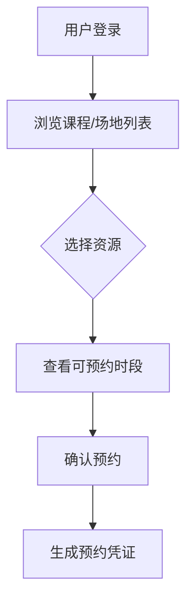
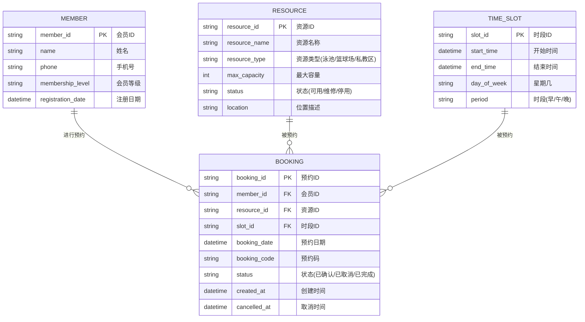

# 软件需求说明书：健身中心预约系统 

## 1. 引言
### 1.1 目的  
为健身中心会员及管理员提供线上课程/场地预约服务，提升资源利用率与用户体验。  
### 1.2 范围  
- 会员：查看课程/场地、预约、取消预约、查看个人预约记录  
- 管理员：管理课程/场地资源、监控预约状态

---

## 2. 用户角色  
| 角色       | 权限描述                     |  
|------------|-----------------------------|  
| 会员       | 预约/取消本人预约、查看资源 |  
| 管理员     | 管理所有资源及预约规则      |  

---

## 3. 功能性需求  
### 3.1 核心功能流程  

---

### 3.2 详细需求说明  
| 功能模块       | 需求描述                                                     |  
|----------------|-------------------------------------------------------------|  
| **资源展示**   | 按日期/类型筛选课程（瑜伽/器械）、场地（篮球场/泳道）       |  
| **预约操作**   | 选择时段→确认→生成唯一预约码（冲突时段拒绝）           |  

#### **资源展示模块**  
| 要素 | 详细规则 |  
|------|----------|  
| **数据维度** | 可筛选：课程类型（瑜伽/搏击/器械指导）、场地类型（泳池/篮球场/私教区）、教练姓名、时段（早/午/晚） |  
| **状态标识** | <ul><li>可预约：绿色标签 + 剩余名额数</li><li>即将满员（剩余≤20%）：黄色标签</li><li>已满员：红色标签 + 候补入口</li><li>维修中：灰色标签 + 停用说明</li><li>实时看板：各场地利用率曲线、课程满员率TOP10</li></ul> |  
| **排序逻辑** | 默认按时间升序，支持按热度（预约率）、评分（教练）手动排序 |  

#### **预约模块**  

| 步骤 | 系统行为 |  
|------|----------|  
| **时段选择** | <ul><li>时间颗粒度：30分钟（如 14:00-14:30）</li><li>冲突检测：自动屏蔽与已有预约重叠时段</li><li>容量检测：实时显示剩余名额（每5秒刷新）</li></ul> |  
| **确认提交** | <ul><li>二次弹窗提示：包含课程/场地名称、时段、教练</li><li>强制阅读《安全政策》（首次预约需勾选确认）</li></ul> |  
| **凭证生成** | <ul><li>唯一预约码：8位数字字母混合（如 A3B9-X2K8）</li><li>动态二维码：含用户ID+预约时段+场地编码</li><li>自动推送：站内消息+短信（含导航链接）</li></ul> |  
| **取消预约** | <ul><li>开课前≥1小时，用户可点击取消</li></ul> |  

---

## 5. 数据需求  
### 5.1 核心业务实体关系

---

## 6. 特殊说明
| 场景                     | 预期结果                     |  
|--------------------------|------------------------------|  
| 会员重复预约          | 弹出提示："您已有XX时段的XX预约" ，系统自动关闭当前页面并跳转至冲突预约详情页 | 
| 课程已满员            | 弹出提示“已满员”        |  
| 开课前1小时           | 点击“取消”时，系统拒绝并提示违约政策 |   

