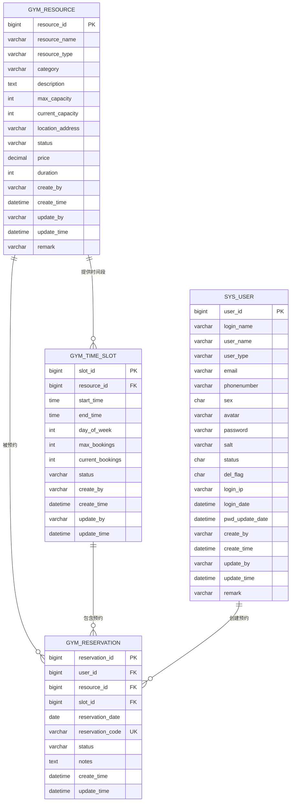
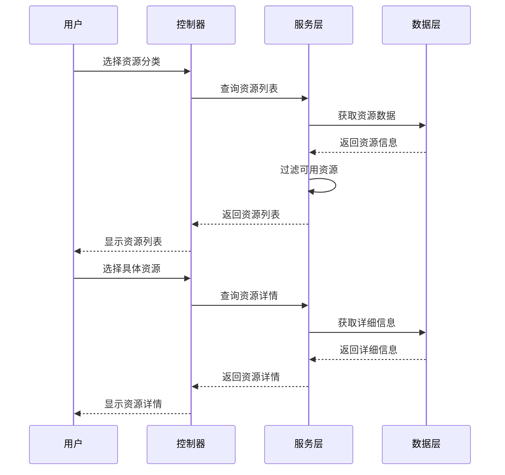
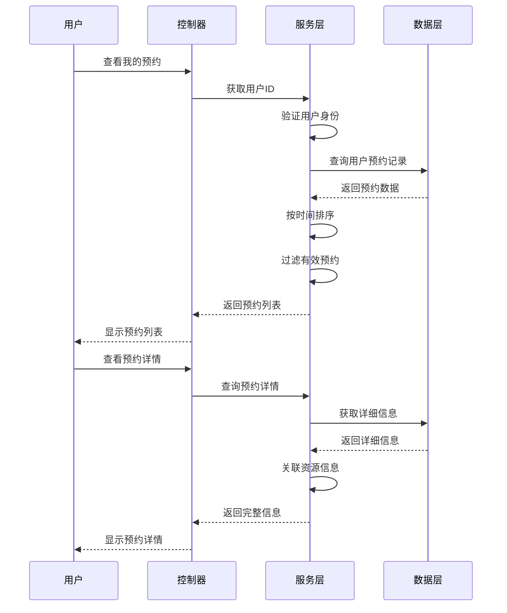
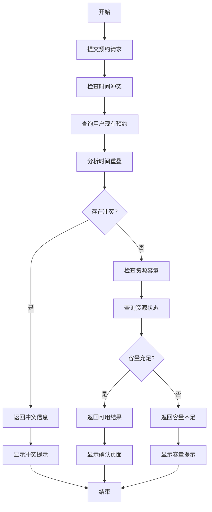
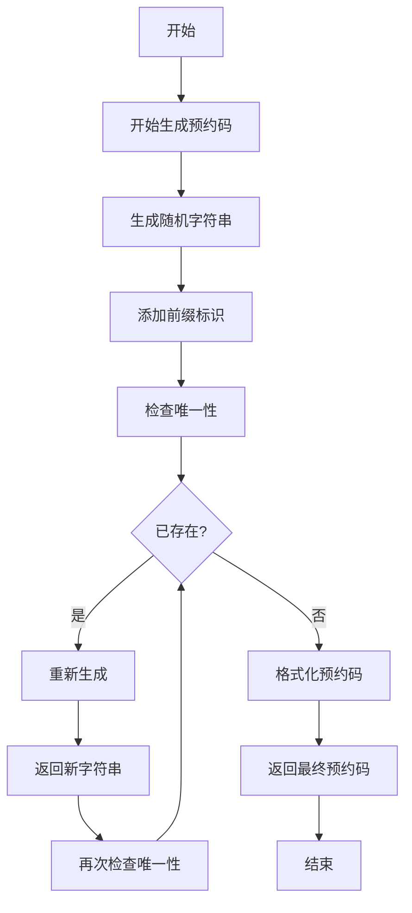

# 健身中心预约系统 - 系统设计文档

## 1. 系统概述

### 1.1 设计目标
基于若依(RuoYi)框架构建健身中心预约管理系统，为健身中心会员提供线上课程/场地预约服务，提升资源利用率与用户体验。

### 1.2 技术架构
- **后端框架**: Spring Boot 2.5.15 + 若依框架 4.8.1
- **安全框架**: Apache Shiro 1.13.0
- **数据库**: MySQL 8.0+
- **前端框架**: Hplus(H+) 后台主题 UI 框架
- **构建工具**: Maven 3.6+
- **Java版本**: JDK 1.8


## 2. 数据库设计

### 2.1 核心数据表设计

**说明**: 健身资源（课程、场地）将预置在数据库中，无需通过系统进行管理操作。

#### 2.1.0 实体关系图 (ER图)



#### 2.1.1 健身资源表 (gym_resource)
```sql
-- 健身资源表（预置数据，无需管理操作）
CREATE TABLE gym_resource (
    resource_id BIGINT(20) NOT NULL AUTO_INCREMENT COMMENT '资源ID',
    resource_name VARCHAR(100) NOT NULL COMMENT '资源名称',
    resource_type VARCHAR(20) NOT NULL COMMENT '资源类型(COURSE/LOCATION)',
    category VARCHAR(50) NOT NULL COMMENT '分类(瑜伽/搏击/器械/泳池/篮球场)',
    description TEXT COMMENT '资源描述',
    max_capacity INT DEFAULT 1 COMMENT '最大容量',
    current_capacity INT DEFAULT 0 COMMENT '当前已预约人数',
    location_address VARCHAR(200) COMMENT '场地地址',
    status VARCHAR(20) DEFAULT 'ACTIVE' COMMENT '状态(ACTIVE/MAINTENANCE/INACTIVE)',
    price DECIMAL(10,2) DEFAULT 0.00 COMMENT '价格',
    duration INT DEFAULT 30 COMMENT '时长(分钟)',
    create_by VARCHAR(64) DEFAULT '' COMMENT '创建者',
    create_time DATETIME COMMENT '创建时间',
    update_by VARCHAR(64) DEFAULT '' COMMENT '更新者',
    update_time DATETIME COMMENT '更新时间',
    remark VARCHAR(500) COMMENT '备注',
    PRIMARY KEY (resource_id)
) ENGINE=InnoDB COMMENT='健身资源表';
```

#### 2.1.2 时间段表 (gym_time_slot)
```sql
CREATE TABLE gym_time_slot (
    slot_id BIGINT(20) NOT NULL AUTO_INCREMENT COMMENT '时间段ID',
    resource_id BIGINT(20) NOT NULL COMMENT '资源ID',
    start_time TIME NOT NULL COMMENT '开始时间',
    end_time TIME NOT NULL COMMENT '结束时间',
    day_of_week INT NOT NULL COMMENT '星期几(1-7)',
    max_bookings INT DEFAULT 1 COMMENT '最大预约数',
    current_bookings INT DEFAULT 0 COMMENT '当前预约数',
    status VARCHAR(20) DEFAULT 'AVAILABLE' COMMENT '状态(AVAILABLE/FULL/MAINTENANCE)',
    create_by VARCHAR(64) DEFAULT '' COMMENT '创建者',
    create_time DATETIME COMMENT '创建时间',
    update_by VARCHAR(64) DEFAULT '' COMMENT '更新者',
    update_time DATETIME COMMENT '更新时间',
    PRIMARY KEY (slot_id)
) ENGINE=InnoDB COMMENT='时间段表';
```

#### 2.1.3 预约记录表 (gym_reservation)
```sql
CREATE TABLE gym_reservation (
    reservation_id BIGINT(20) NOT NULL AUTO_INCREMENT COMMENT '预约ID',
    user_id BIGINT(20) NOT NULL COMMENT '用户ID',
    resource_id BIGINT(20) NOT NULL COMMENT '资源ID',
    slot_id BIGINT(20) NOT NULL COMMENT '时间段ID',
    reservation_date DATE NOT NULL COMMENT '预约日期',
    reservation_code VARCHAR(20) NOT NULL COMMENT '预约码',
    status VARCHAR(20) DEFAULT 'CONFIRMED' COMMENT '状态(CONFIRMED/CANCELLED)',
    notes TEXT COMMENT '备注',
    create_time DATETIME COMMENT '创建时间',
    update_time DATETIME COMMENT '更新时间',
    PRIMARY KEY (reservation_id),
    UNIQUE KEY uk_reservation_code (reservation_code),
    INDEX idx_user_date (user_id, reservation_date),
    INDEX idx_resource_date (resource_id, reservation_date)
) ENGINE=InnoDB COMMENT='预约记录表';
```


### 2.2 数据字典设计

#### 2.2.1 资源类型字典
| 字典值 | 字典标签 | 说明 |
|--------|----------|------|
| COURSE | 课程 | 健身课程 |
| LOCATION | 场地 | 健身场地 |

#### 2.2.2 资源分类字典
| 字典值 | 字典标签 | 说明 |
|--------|----------|------|
| YOGA | 瑜伽 | 瑜伽课程 |
| BOXING | 搏击 | 搏击课程 |
| EQUIPMENT | 器械 | 器械训练 |
| POOL | 泳池 | 游泳池 |
| BASKETBALL | 篮球场 | 篮球场 |

#### 2.2.3 预约状态字典
| 字典值 | 字典标签 | 说明 |
|--------|----------|------|
| CONFIRMED | 已确认 | 预约已确认 |
| CANCELLED | 已取消 | 预约已取消 |

## 3. 系统模块设计

### 3.1 模块架构图
```
健身中心预约系统
├── 预约管理模块
│   ├── 预约服务
│   └── 取消服务
├── 时间管理模块
│   ├── 时间段配置
│   └── 冲突检测
└── 资源查询模块
    ├── 资源浏览
    ├── 可用性查询
    └── 容量查询
```

### 3.2 核心业务模块设计

#### 3.2.1 资源查询模块
**功能职责**:
- 健身资源的查询展示
- 资源可用性检查
- 容量信息查询
- 资源分类筛选

**核心类设计**:
```java
// 资源实体类
public class GymResource {
    private Long resourceId;
    private String resourceName;
    private String resourceType; // COURSE/LOCATION
    private String category;
    private String description;
    private Integer maxCapacity;
    private Integer currentCapacity;
    private String locationAddress;
    private String status;
    private BigDecimal price;
    private Integer duration;
    // ... getter/setter
}

// 资源查询服务接口
public interface IGymResourceService {
    /**
     * 查询资源列表
     * @param resource 查询条件
     * @return 资源列表
     */
    List<GymResource> selectResourceList(GymResource resource);
    
    /**
     * 根据ID查询资源详情
     * @param resourceId 资源ID
     * @return 资源详情
     */
    GymResource selectResourceById(Long resourceId);
    
    /**
     * 查询指定分类和日期的可用资源
     * @param category 资源分类
     * @param date 查询日期
     * @return 可用资源列表
     */
    List<GymResource> selectAvailableResources(String category, Date date);
    
    /**
     * 检查资源在指定时间段是否可用
     * @param resourceId 资源ID
     * @param date 日期
     * @param startTime 开始时间
     * @param endTime 结束时间
     * @return 是否可用
     */
    boolean isResourceAvailable(Long resourceId, Date date, Time startTime, Time endTime);
    
    /**
     * 获取资源在指定时间段的可用容量
     * @param resourceId 资源ID
     * @param date 日期
     * @param startTime 开始时间
     * @param endTime 结束时间
     * @return 可用容量
     */
    int getAvailableCapacity(Long resourceId, Date date, Time startTime, Time endTime);
}
```

#### 3.2.2 预约管理模块
**功能职责**:
- 预约创建与确认
- 预约冲突检测
- 预约码生成
- 预约状态管理
- 取消预约处理

**核心类设计**:
```java
// 预约实体类
public class GymReservation {
    private Long reservationId;
    private Long userId;
    private Long resourceId;
    private Long slotId;
    private Date reservationDate;
    private String reservationCode;
    private String status;
    private String notes;
    // ... getter/setter
}

// 预约服务接口
public interface IGymReservationService {
    /**
     * 创建预约
     * @param reservation 预约信息
     * @return 预约结果
     */
    AjaxResult createReservation(GymReservation reservation);
    
    /**
     * 取消预约
     */
    AjaxResult cancelReservation(Long reservationId, Long userId);
    
    /**
     * 查询用户预约列表
     * @param userId 用户ID
     * @return 预约列表
     */
    List<GymReservation> selectUserReservations(Long userId);
    
    /**
     * 检查时间冲突
     * @param userId 用户ID
     * @param resourceId 资源ID
     * @param date 日期
     * @param startTime 开始时间
     * @param endTime 结束时间
     * @return 是否存在冲突
     */
    boolean checkTimeConflict(Long userId, Long resourceId, Date date, Time startTime, Time endTime);
    
    /**
     * 生成预约码
     * @return 预约码
     */
    String generateReservationCode();
}
```

#### 3.2.3 时间管理模块
**功能职责**:
- 时间段配置管理
- 时间冲突检测
- 容量管理
- 可用性检查

**核心类设计**:
```java
// 时间段实体类
public class GymTimeSlot {
    private Long slotId;
    private Long resourceId;
    private Time startTime;
    private Time endTime;
    private Integer dayOfWeek;
    private Integer maxBookings;
    private Integer currentBookings;
    private String status;
    // ... getter/setter
}

// 时间管理服务接口
public interface IGymTimeSlotService {
    /**
     * 查询可用时间段
     * @param resourceId 资源ID
     * @param date 日期
     * @return 可用时间段列表
     */
    List<GymTimeSlot> selectAvailableSlots(Long resourceId, Date date);
    
    /**
     * 检查时间段是否可用
     * @param slotId 时间段ID
     * @param date 日期
     * @return 是否可用
     */
    boolean isSlotAvailable(Long slotId, Date date);
    
    /**
     * 更新时间段容量
     * @param slotId 时间段ID
     * @param change 容量变化值（正数增加，负数减少）
     * @return 更新结果
     */
    int updateSlotCapacity(Long slotId, int change);
    
    /**
     * 查询资源时间表
     * @param resourceId 资源ID
     * @return 时间表列表
     */
    List<GymTimeSlot> selectResourceSchedule(Long resourceId);
}
```

### 3.3 控制器层设计

#### 3.3.1 会员端控制器
```java
@Controller
@RequestMapping("/gym")
public class GymMemberController extends BaseController {
    
    @Autowired
    private IGymResourceService resourceService;
    
    @Autowired
    private IGymReservationService reservationService;
    
    // 资源浏览
    @GetMapping("/resources")
    @ResponseBody
    public AjaxResult listResources(GymResource resource) {
        return AjaxResult.success(resourceService.selectResourceList(resource));
    }
    
    // 创建预约
    @PostMapping("/reservation")
    @ResponseBody
    public AjaxResult createReservation(@RequestBody GymReservation reservation) {
        return reservationService.createReservation(reservation);
    }
    
    // 我的预约
    @GetMapping("/my-reservations")
    @ResponseBody
    public AjaxResult myReservations() {
        Long userId = getUserId();
        return AjaxResult.success(reservationService.selectUserReservations(userId));
    }
    
    // 取消预约
    @PostMapping("/cancel/{reservationId}")
    @ResponseBody
    public AjaxResult cancelReservation(@PathVariable Long reservationId) {
        return reservationService.cancelReservation(reservationId, getUserId());
    }
}
```


## 4. 业务流程设计

### 4.1 预约流程


### 4.2 取消预约流程


### 4.3 资源查询流程


### 4.4 用户预约查询流程


### 4.5 冲突检测流程


### 4.6 预约码生成流程

### 4.7 查询时间段容量